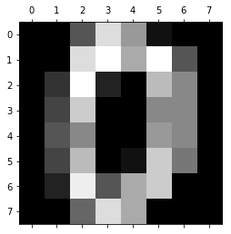
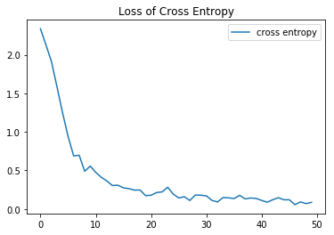
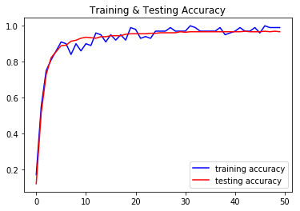
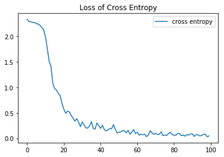
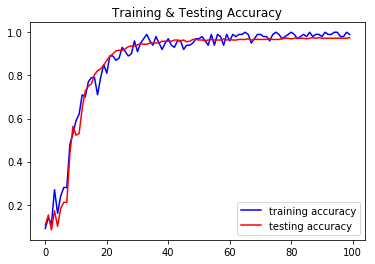

# Self Create Data Set


```python
import numpy as np
import itertools
in_perm = []
in_perm.extend(list(itertools.permutations([0.0, 0.0, 0.0])))
in_perm.extend(list(itertools.permutations([1.0, 0.0, 0.0])))
in_perm.extend(list(itertools.permutations([1.0, 1.0, 0.0])))
in_perm.extend(list(itertools.permutations([1.0, 1.0, 1.0])))
input_vects = np.array(in_perm).reshape(24,3)
print(len(input_vects))
obj_func = lambda x: np.array((np.sum(x)%2, (np.sum(x)+1)%2))
target_vects = np.apply_along_axis(obj_func, 1, input_vects)
print('input:\n', input_vects)
print('target:\n', target_vects)
```

    24
    input:
     [[0. 0. 0.]
     [0. 0. 0.]
     [0. 0. 0.]
     [0. 0. 0.]
     [0. 0. 0.]
     [0. 0. 0.]
     [1. 0. 0.]
     [1. 0. 0.]
     [0. 1. 0.]
     [0. 0. 1.]
     [0. 1. 0.]
     [0. 0. 1.]
     [1. 1. 0.]
     [1. 0. 1.]
     [1. 1. 0.]
     [1. 0. 1.]
     [0. 1. 1.]
     [0. 1. 1.]
     [1. 1. 1.]
     [1. 1. 1.]
     [1. 1. 1.]
     [1. 1. 1.]
     [1. 1. 1.]
     [1. 1. 1.]]
    target:
     [[0. 1.]
     [0. 1.]
     [0. 1.]
     [0. 1.]
     [0. 1.]
     [0. 1.]
     [1. 0.]
     [1. 0.]
     [1. 0.]
     [1. 0.]
     [1. 0.]
     [1. 0.]
     [0. 1.]
     [0. 1.]
     [0. 1.]
     [0. 1.]
     [0. 1.]
     [0. 1.]
     [1. 0.]
     [1. 0.]
     [1. 0.]
     [1. 0.]
     [1. 0.]
     [1. 0.]]


```python
import net
nn = net.NeuralNet(3, 2, [5, 5])
nn.dump()
out = nn.predict(input_vects)
print(out)
print(nn.loss(out, target_vects))
```

    ------
    weight:
     [[ 0.00731007  0.05101852  0.1547849   0.05115226  0.12268522]
     [ 0.02325519  0.0210894  -0.09895071 -0.2302177  -0.01330932]
     [ 0.14186956  0.05800872  0.24086507 -0.08728282 -0.12119817]]
    bias:
     [[ 0.00731007  0.05101852  0.1547849   0.05115226  0.12268522]
     [ 0.02325519  0.0210894  -0.09895071 -0.2302177  -0.01330932]
     [ 0.14186956  0.05800872  0.24086507 -0.08728282 -0.12119817]]
    ------
    weight:
     [[-0.02331072 -0.07949589  0.09544081 -0.158361    0.06124505]
     [-0.00664799 -0.18097211 -0.05488319 -0.03812984 -0.02588613]
     [ 0.01700033 -0.16250006  0.15070375  0.05765163  0.02194747]
     [ 0.00140205 -0.03529639  0.0776557  -0.18908656  0.12376287]
     [ 0.1913583   0.05514358 -0.09983006 -0.20788377 -0.03503711]]
    bias:
     [[-0.02331072 -0.07949589  0.09544081 -0.158361    0.06124505]
     [-0.00664799 -0.18097211 -0.05488319 -0.03812984 -0.02588613]
     [ 0.01700033 -0.16250006  0.15070375  0.05765163  0.02194747]
     [ 0.00140205 -0.03529639  0.0776557  -0.18908656  0.12376287]
     [ 0.1913583   0.05514358 -0.09983006 -0.20788377 -0.03503711]]
    ------
    weight:
     [[-0.04532618  0.11163597]
     [-0.07818875  0.11400895]
     [ 0.03950682  0.06603908]
     [ 0.18328332 -0.00359709]
     [ 0.01597361 -0.13426432]]
    bias:
     [[-0.04532618  0.11163597]
     [-0.07818875  0.11400895]
     [ 0.03950682  0.06603908]
     [ 0.18328332 -0.00359709]
     [ 0.01597361 -0.13426432]]
    [[0.51113437 0.48886563]
     [0.51113437 0.48886563]
     [0.51113437 0.48886563]
     [0.51113437 0.48886563]
     [0.51113437 0.48886563]
     [0.51113437 0.48886563]
     [0.51107996 0.48892004]
     [0.51107996 0.48892004]
     [0.51114328 0.48885672]
     [0.51146173 0.48853827]
     [0.51114328 0.48885672]
     [0.51146173 0.48853827]
     [0.51108888 0.48891112]
     [0.51140681 0.48859319]
     [0.51108888 0.48891112]
     [0.51140681 0.48859319]
     [0.51147005 0.48852995]
     [0.51147005 0.48852995]
     [0.51141643 0.48858357]
     [0.51141643 0.48858357]
     [0.51141643 0.48858357]
     [0.51141643 0.48858357]
     [0.51141643 0.48858357]
     [0.51141643 0.48858357]]
    0.6933070720563711


```python
for i in range(1000):
    nn.update(input_vects, target_vects, 1)
    #print(nn.loss(nn.predict(input_vects), target_vects))
predict_vects = nn.predict_encode(nn.predict(input_vects))
print(predict_vects)
print(nn.accuracy(predict_vects, target_vects))
```

    [[0. 1.]
     [0. 1.]
     [0. 1.]
     [0. 1.]
     [0. 1.]
     [0. 1.]
     [1. 0.]
     [1. 0.]
     [1. 0.]
     [1. 0.]
     [1. 0.]
     [1. 0.]
     [1. 0.]
     [1. 0.]
     [1. 0.]
     [1. 0.]
     [1. 0.]
     [1. 0.]
     [1. 0.]
     [1. 0.]
     [1. 0.]
     [1. 0.]
     [1. 0.]
     [1. 0.]]
    0.75


# Digital Number Data Set


```python
from sklearn.datasets import load_digits
from sklearn.model_selection import train_test_split
import matplotlib.pyplot as plt
import pandas as pd
import numpy as np
```

## Load digital data


```python
digits = load_digits()
print(digits.data.shape)
plt.gray()
plt.matshow(digits.images[0])
plt.show()
```

    (1797, 64)


    <Figure size 432x288 with 0 Axes>





```python
data_df = pd.DataFrame(digits['data'])
data_df.head()
```


<div>
<style scoped>
    .dataframe tbody tr th:only-of-type {
        vertical-align: middle;
    }

    .dataframe tbody tr th {
        vertical-align: top;
    }

    .dataframe thead th {
        text-align: right;
    }
</style>
<table border="1" class="dataframe">
  <thead>
    <tr style="text-align: right;">
      <th></th>
      <th>0</th>
      <th>1</th>
      <th>2</th>
      <th>3</th>
      <th>4</th>
      <th>5</th>
      <th>6</th>
      <th>7</th>
      <th>8</th>
      <th>9</th>
      <th>...</th>
      <th>54</th>
      <th>55</th>
      <th>56</th>
      <th>57</th>
      <th>58</th>
      <th>59</th>
      <th>60</th>
      <th>61</th>
      <th>62</th>
      <th>63</th>
    </tr>
  </thead>
  <tbody>
    <tr>
      <th>0</th>
      <td>0.0</td>
      <td>0.0</td>
      <td>5.0</td>
      <td>13.0</td>
      <td>9.0</td>
      <td>1.0</td>
      <td>0.0</td>
      <td>0.0</td>
      <td>0.0</td>
      <td>0.0</td>
      <td>...</td>
      <td>0.0</td>
      <td>0.0</td>
      <td>0.0</td>
      <td>0.0</td>
      <td>6.0</td>
      <td>13.0</td>
      <td>10.0</td>
      <td>0.0</td>
      <td>0.0</td>
      <td>0.0</td>
    </tr>
    <tr>
      <th>1</th>
      <td>0.0</td>
      <td>0.0</td>
      <td>0.0</td>
      <td>12.0</td>
      <td>13.0</td>
      <td>5.0</td>
      <td>0.0</td>
      <td>0.0</td>
      <td>0.0</td>
      <td>0.0</td>
      <td>...</td>
      <td>0.0</td>
      <td>0.0</td>
      <td>0.0</td>
      <td>0.0</td>
      <td>0.0</td>
      <td>11.0</td>
      <td>16.0</td>
      <td>10.0</td>
      <td>0.0</td>
      <td>0.0</td>
    </tr>
    <tr>
      <th>2</th>
      <td>0.0</td>
      <td>0.0</td>
      <td>0.0</td>
      <td>4.0</td>
      <td>15.0</td>
      <td>12.0</td>
      <td>0.0</td>
      <td>0.0</td>
      <td>0.0</td>
      <td>0.0</td>
      <td>...</td>
      <td>5.0</td>
      <td>0.0</td>
      <td>0.0</td>
      <td>0.0</td>
      <td>0.0</td>
      <td>3.0</td>
      <td>11.0</td>
      <td>16.0</td>
      <td>9.0</td>
      <td>0.0</td>
    </tr>
    <tr>
      <th>3</th>
      <td>0.0</td>
      <td>0.0</td>
      <td>7.0</td>
      <td>15.0</td>
      <td>13.0</td>
      <td>1.0</td>
      <td>0.0</td>
      <td>0.0</td>
      <td>0.0</td>
      <td>8.0</td>
      <td>...</td>
      <td>9.0</td>
      <td>0.0</td>
      <td>0.0</td>
      <td>0.0</td>
      <td>7.0</td>
      <td>13.0</td>
      <td>13.0</td>
      <td>9.0</td>
      <td>0.0</td>
      <td>0.0</td>
    </tr>
    <tr>
      <th>4</th>
      <td>0.0</td>
      <td>0.0</td>
      <td>0.0</td>
      <td>1.0</td>
      <td>11.0</td>
      <td>0.0</td>
      <td>0.0</td>
      <td>0.0</td>
      <td>0.0</td>
      <td>0.0</td>
      <td>...</td>
      <td>0.0</td>
      <td>0.0</td>
      <td>0.0</td>
      <td>0.0</td>
      <td>0.0</td>
      <td>2.0</td>
      <td>16.0</td>
      <td>4.0</td>
      <td>0.0</td>
      <td>0.0</td>
    </tr>
  </tbody>
</table>
<p>5 rows × 64 columns</p>
</div>


```python
label_df = pd.DataFrame(digits['target'])
label_df.head()
```


<div>
<style scoped>
    .dataframe tbody tr th:only-of-type {
        vertical-align: middle;
    }

    .dataframe tbody tr th {
        vertical-align: top;
    }

    .dataframe thead th {
        text-align: right;
    }
</style>
<table border="1" class="dataframe">
  <thead>
    <tr style="text-align: right;">
      <th></th>
      <th>0</th>
    </tr>
  </thead>
  <tbody>
    <tr>
      <th>0</th>
      <td>0</td>
    </tr>
    <tr>
      <th>1</th>
      <td>1</td>
    </tr>
    <tr>
      <th>2</th>
      <td>2</td>
    </tr>
    <tr>
      <th>3</th>
      <td>3</td>
    </tr>
    <tr>
      <th>4</th>
      <td>4</td>
    </tr>
  </tbody>
</table>
</div>


## Feature max-min normailize


```python
#from scipy.stats import zscore
def normalize(x):
    m = x.max()
    if m != 0:
        return x/m
    else:
        return x
data_df = data_df.apply(normalize, axis=0)
data_df.head()
```


<div>
<style scoped>
    .dataframe tbody tr th:only-of-type {
        vertical-align: middle;
    }

    .dataframe tbody tr th {
        vertical-align: top;
    }

    .dataframe thead th {
        text-align: right;
    }
</style>
<table border="1" class="dataframe">
  <thead>
    <tr style="text-align: right;">
      <th></th>
      <th>0</th>
      <th>1</th>
      <th>2</th>
      <th>3</th>
      <th>4</th>
      <th>5</th>
      <th>6</th>
      <th>7</th>
      <th>8</th>
      <th>9</th>
      <th>...</th>
      <th>54</th>
      <th>55</th>
      <th>56</th>
      <th>57</th>
      <th>58</th>
      <th>59</th>
      <th>60</th>
      <th>61</th>
      <th>62</th>
      <th>63</th>
    </tr>
  </thead>
  <tbody>
    <tr>
      <th>0</th>
      <td>0.0</td>
      <td>0.0</td>
      <td>0.3125</td>
      <td>0.8125</td>
      <td>0.5625</td>
      <td>0.0625</td>
      <td>0.0</td>
      <td>0.0</td>
      <td>0.0</td>
      <td>0.0</td>
      <td>...</td>
      <td>0.0000</td>
      <td>0.0</td>
      <td>0.0</td>
      <td>0.0</td>
      <td>0.3750</td>
      <td>0.8125</td>
      <td>0.6250</td>
      <td>0.0000</td>
      <td>0.0000</td>
      <td>0.0</td>
    </tr>
    <tr>
      <th>1</th>
      <td>0.0</td>
      <td>0.0</td>
      <td>0.0000</td>
      <td>0.7500</td>
      <td>0.8125</td>
      <td>0.3125</td>
      <td>0.0</td>
      <td>0.0</td>
      <td>0.0</td>
      <td>0.0</td>
      <td>...</td>
      <td>0.0000</td>
      <td>0.0</td>
      <td>0.0</td>
      <td>0.0</td>
      <td>0.0000</td>
      <td>0.6875</td>
      <td>1.0000</td>
      <td>0.6250</td>
      <td>0.0000</td>
      <td>0.0</td>
    </tr>
    <tr>
      <th>2</th>
      <td>0.0</td>
      <td>0.0</td>
      <td>0.0000</td>
      <td>0.2500</td>
      <td>0.9375</td>
      <td>0.7500</td>
      <td>0.0</td>
      <td>0.0</td>
      <td>0.0</td>
      <td>0.0</td>
      <td>...</td>
      <td>0.3125</td>
      <td>0.0</td>
      <td>0.0</td>
      <td>0.0</td>
      <td>0.0000</td>
      <td>0.1875</td>
      <td>0.6875</td>
      <td>1.0000</td>
      <td>0.5625</td>
      <td>0.0</td>
    </tr>
    <tr>
      <th>3</th>
      <td>0.0</td>
      <td>0.0</td>
      <td>0.4375</td>
      <td>0.9375</td>
      <td>0.8125</td>
      <td>0.0625</td>
      <td>0.0</td>
      <td>0.0</td>
      <td>0.0</td>
      <td>0.5</td>
      <td>...</td>
      <td>0.5625</td>
      <td>0.0</td>
      <td>0.0</td>
      <td>0.0</td>
      <td>0.4375</td>
      <td>0.8125</td>
      <td>0.8125</td>
      <td>0.5625</td>
      <td>0.0000</td>
      <td>0.0</td>
    </tr>
    <tr>
      <th>4</th>
      <td>0.0</td>
      <td>0.0</td>
      <td>0.0000</td>
      <td>0.0625</td>
      <td>0.6875</td>
      <td>0.0000</td>
      <td>0.0</td>
      <td>0.0</td>
      <td>0.0</td>
      <td>0.0</td>
      <td>...</td>
      <td>0.0000</td>
      <td>0.0</td>
      <td>0.0</td>
      <td>0.0</td>
      <td>0.0000</td>
      <td>0.1250</td>
      <td>1.0000</td>
      <td>0.2500</td>
      <td>0.0000</td>
      <td>0.0</td>
    </tr>
  </tbody>
</table>
<p>5 rows × 64 columns</p>
</div>


## Target label one-hot encodeing


```python
label_df = pd.get_dummies(label_df[0])
label_df.head()
```


<div>
<style scoped>
    .dataframe tbody tr th:only-of-type {
        vertical-align: middle;
    }

    .dataframe tbody tr th {
        vertical-align: top;
    }

    .dataframe thead th {
        text-align: right;
    }
</style>
<table border="1" class="dataframe">
  <thead>
    <tr style="text-align: right;">
      <th></th>
      <th>0</th>
      <th>1</th>
      <th>2</th>
      <th>3</th>
      <th>4</th>
      <th>5</th>
      <th>6</th>
      <th>7</th>
      <th>8</th>
      <th>9</th>
    </tr>
  </thead>
  <tbody>
    <tr>
      <th>0</th>
      <td>1</td>
      <td>0</td>
      <td>0</td>
      <td>0</td>
      <td>0</td>
      <td>0</td>
      <td>0</td>
      <td>0</td>
      <td>0</td>
      <td>0</td>
    </tr>
    <tr>
      <th>1</th>
      <td>0</td>
      <td>1</td>
      <td>0</td>
      <td>0</td>
      <td>0</td>
      <td>0</td>
      <td>0</td>
      <td>0</td>
      <td>0</td>
      <td>0</td>
    </tr>
    <tr>
      <th>2</th>
      <td>0</td>
      <td>0</td>
      <td>1</td>
      <td>0</td>
      <td>0</td>
      <td>0</td>
      <td>0</td>
      <td>0</td>
      <td>0</td>
      <td>0</td>
    </tr>
    <tr>
      <th>3</th>
      <td>0</td>
      <td>0</td>
      <td>0</td>
      <td>1</td>
      <td>0</td>
      <td>0</td>
      <td>0</td>
      <td>0</td>
      <td>0</td>
      <td>0</td>
    </tr>
    <tr>
      <th>4</th>
      <td>0</td>
      <td>0</td>
      <td>0</td>
      <td>0</td>
      <td>1</td>
      <td>0</td>
      <td>0</td>
      <td>0</td>
      <td>0</td>
      <td>0</td>
    </tr>
  </tbody>
</table>
</div>


## Data set split


```python
data_train, data_test, target_train, target_test = train_test_split(np.array(data_df), np.array(label_df), test_size = 0.2)
```

## Build and train network


```python
from tqdm import tqdm
import net

nn = net.NeuralNet(64, 10, [64])

iteration = 5000
learning_rate = 0.1
batch_size = 100

cross_entropy_line = []
train_acc_line = []
test_acc_line = []

for i in tqdm(range(iteration)):
    #print('--- iteration: {} ---'.format(i))
    sample_idx = np.random.choice(len(data_train), batch_size)
    train_batch = data_train[sample_idx]
    target_batch = target_train[sample_idx]
    nn.update(train_batch, target_batch, learning_rate)
    if i % 100 == 0:
        train_predicts = nn.predict(train_batch)
        ce = nn.loss(train_predicts, target_batch)
        cross_entropy_line.append(ce)

        train_acc = nn.accuracy(nn.predict_encode(train_predicts), target_batch)
        train_acc_line.append(train_acc)

        test_predicts = nn.predict(data_test)
        test_acc = nn.accuracy(nn.predict_encode(test_predicts), target_test)
        test_acc_line.append(test_acc)
        
plt.title('Loss of Cross Entropy')
plt.plot(cross_entropy_line, label = 'cross entropy')
plt.legend()
plt.show()
plt.title('Training & Testing Accuracy')
plt.plot(train_acc_line, 'b', label = 'training accuracy')
plt.plot(test_acc_line, 'r', label = 'testing accuracy')
plt.legend()
plt.show()

print('===== Final Result =====')
train_predicts = nn.predict(train_batch)
ce = nn.loss(train_predicts, target_batch)
cross_entropy_line.append(ce)
print('loss:', ce)
train_acc = nn.accuracy(nn.predict_encode(train_predicts), target_batch)
train_acc_line.append(train_acc)
print('train_acc:', train_acc)
test_predicts = nn.predict(data_test)
test_acc = nn.accuracy(nn.predict_encode(test_predicts), target_test)
test_acc_line.append(test_acc)
print('test_acc:', test_acc)

```

    100%|██████████| 5000/5000 [00:17<00:00, 289.05it/s]








    ===== Final Result =====
    loss: 0.14971143757018474
    train_acc: 0.96
    test_acc: 0.9666666666666667


## Try different network structure


```python
from tqdm import tqdm
import net

nn = net.NeuralNet(64, 10, [64, 32])

iteration = 10000
learning_rate = 0.1
batch_size = 100

cross_entropy_line = []
train_acc_line = []
test_acc_line = []

for i in tqdm(range(iteration)):
    #print('--- iteration: {} ---'.format(i))
    sample_idx = np.random.choice(len(data_train), batch_size)
    train_batch = data_train[sample_idx]
    target_batch = target_train[sample_idx]
    nn.update(train_batch, target_batch, learning_rate)
    if i % 100 == 0:
        train_predicts = nn.predict(train_batch)
        ce = nn.loss(train_predicts, target_batch)
        cross_entropy_line.append(ce)

        train_acc = nn.accuracy(nn.predict_encode(train_predicts), target_batch)
        train_acc_line.append(train_acc)

        test_predicts = nn.predict(data_test)
        test_acc = nn.accuracy(nn.predict_encode(test_predicts), target_test)
        test_acc_line.append(test_acc)
        
plt.title('Loss of Cross Entropy')
plt.plot(cross_entropy_line, label = 'cross entropy')
plt.legend()
plt.show()
plt.title('Training & Testing Accuracy')
plt.plot(train_acc_line, 'b', label = 'training accuracy')
plt.plot(test_acc_line, 'r', label = 'testing accuracy')
plt.legend()
plt.show()

print('===== Final Result =====')
train_predicts = nn.predict(train_batch)
ce = nn.loss(train_predicts, target_batch)
cross_entropy_line.append(ce)
print('loss:', ce)
train_acc = nn.accuracy(nn.predict_encode(train_predicts), target_batch)
train_acc_line.append(train_acc)
print('train_acc:', train_acc)
test_predicts = nn.predict(data_test)
test_acc = nn.accuracy(nn.predict_encode(test_predicts), target_test)
test_acc_line.append(test_acc)
print('test_acc:', test_acc)

```

    100%|██████████| 10000/10000 [00:47<00:00, 210.25it/s]








    ===== Final Result =====
    loss: 0.05885961309942258
    train_acc: 0.98
    test_acc: 0.9777777777777777


```python

```
