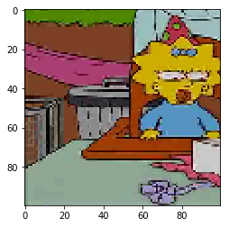
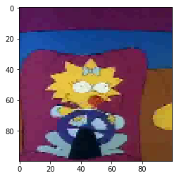
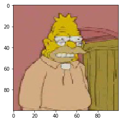
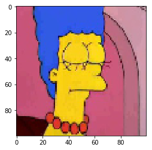

# Kaggle Simpson Classification using Tensorflow

This practice uses kaggle simpson dataset and it can be downloaded from [here](https://www.kaggle.com/alexattia/the-simpsons-characters-dataset).

## Import Library


```python
import pathlib
import random
import numpy as np
import tensorflow as tf
import matplotlib.pyplot as plt
from PIL import Image
```

## Load Data Set


```python
root_path = pathlib.Path('.').resolve()
trainset_path = root_path.joinpath('kaggle_simpson_dataset').glob('*simpson*/*.jpg')
testset_path = root_path.joinpath('kaggle_simpson_testset').glob('*simpson*.jpg')

class_name = ['homer', 'lisa', 'bart', 'marge', 'grampa', 'maggie']

trainset_input = []
trainset_target = []
testset_input = []
testset_target = []

def get_label(path):
    for i in range(len(class_name)):
        if class_name[i] in path:
            return i
    else:
        raise TypeError('class name not found:{}'.format(path))
        
def show_img(img):
    plt.imshow(img)
    plt.show()
    
for path in trainset_path:
    pic = Image.open(path)
    pic = pic.resize((100, 100))
    a = np.array(pic)
    trainset_input.append(a)
    trainset_target.append(get_label(str(path)))
    
for path in testset_path:
    pic = Image.open(path)
    pic = pic.resize((100, 100))
    a = np.array(pic)
    testset_input.append(a)
    testset_target.append(get_label(str(path)))
    
show_img(trainset_input[0])
print(class_name[trainset_target[0]])
show_img(trainset_input[30])
print(class_name[trainset_target[30]])
show_img(testset_input[20])
print(class_name[testset_target[20]])
show_img(testset_input[100])
print(class_name[testset_target[100]])

trainset_input = np.asarray(trainset_input)
trainset_target = np.asarray(trainset_target)
testset_input = np.asarray(testset_input)
testset_target = np.asarray(testset_target)

print('trainset_input shape:', trainset_input.shape)
print('testset_input size:', testset_input.shape)

```





    maggie





    maggie





    grampa





    marge
    trainset_input shape: (7274, 100, 100, 3)
    testset_input size: (248, 100, 100, 3)


## Build Model


```python
model = tf.keras.models.Sequential()
model.add(tf.keras.layers.Conv2D(64, (2, 2), activation='relu', input_shape=(100, 100, 3)))
model.add(tf.keras.layers.Conv2D(32, (4, 4), activation='relu'))
model.add(tf.keras.layers.Conv2D(16, (8, 8), activation='relu'))
model.add(tf.keras.layers.MaxPooling2D((3, 3)))
model.add(tf.keras.layers.Flatten())
model.add(tf.keras.layers.Dense(64, activation='relu'))
model.add(tf.keras.layers.Dense(64, activation='relu'))
model.add(tf.keras.layers.Dense(32, activation='relu'))
model.add(tf.keras.layers.Dense(32, activation='relu'))
model.add(tf.keras.layers.Dense(16, activation='relu'))
model.add(tf.keras.layers.Dense(16, activation='relu'))
model.add(tf.keras.layers.Dense(8, activation='relu'))
model.add(tf.keras.layers.Dense(8, activation='relu'))
model.add(tf.keras.layers.Dense(6, activation='softmax'))
model.summary()
```

    WARNING:tensorflow:From /home/t387358/.local/lib/python3.6/site-packages/tensorflow/python/ops/resource_variable_ops.py:435: colocate_with (from tensorflow.python.framework.ops) is deprecated and will be removed in a future version.
    Instructions for updating:
    Colocations handled automatically by placer.
    _________________________________________________________________
    Layer (type)                 Output Shape              Param #   
    =================================================================
    conv2d (Conv2D)              (None, 99, 99, 64)        832       
    _________________________________________________________________
    conv2d_1 (Conv2D)            (None, 96, 96, 32)        32800     
    _________________________________________________________________
    conv2d_2 (Conv2D)            (None, 89, 89, 16)        32784     
    _________________________________________________________________
    max_pooling2d (MaxPooling2D) (None, 29, 29, 16)        0         
    _________________________________________________________________
    flatten (Flatten)            (None, 13456)             0         
    _________________________________________________________________
    dense (Dense)                (None, 64)                861248    
    _________________________________________________________________
    dense_1 (Dense)              (None, 64)                4160      
    _________________________________________________________________
    dense_2 (Dense)              (None, 32)                2080      
    _________________________________________________________________
    dense_3 (Dense)              (None, 32)                1056      
    _________________________________________________________________
    dense_4 (Dense)              (None, 16)                528       
    _________________________________________________________________
    dense_5 (Dense)              (None, 16)                272       
    _________________________________________________________________
    dense_6 (Dense)              (None, 8)                 136       
    _________________________________________________________________
    dense_7 (Dense)              (None, 8)                 72        
    _________________________________________________________________
    dense_8 (Dense)              (None, 6)                 54        
    =================================================================
    Total params: 936,022
    Trainable params: 936,022
    Non-trainable params: 0
    _________________________________________________________________


## Train Model


```python
model.compile(optimizer='adam',
              loss='sparse_categorical_crossentropy',
              metrics=['accuracy'])

model.fit(trainset_input, trainset_target, epochs=30)
```

    Epoch 1/30
    7274/7274 [==============================] - 21s 3ms/sample - loss: 1.5761 - acc: 0.3368
    Epoch 2/30
    7274/7274 [==============================] - 19s 3ms/sample - loss: 1.2676 - acc: 0.5147
    Epoch 3/30
    7274/7274 [==============================] - 18s 3ms/sample - loss: 1.0659 - acc: 0.5803
    Epoch 4/30
    7274/7274 [==============================] - 18s 3ms/sample - loss: 0.9936 - acc: 0.6156
    Epoch 5/30
    7274/7274 [==============================] - 18s 3ms/sample - loss: 0.8323 - acc: 0.6772
    Epoch 6/30
    7274/7274 [==============================] - 18s 3ms/sample - loss: 0.7456 - acc: 0.7101
    Epoch 7/30
    7274/7274 [==============================] - 18s 3ms/sample - loss: 0.6362 - acc: 0.7481
    Epoch 8/30
    7274/7274 [==============================] - 18s 3ms/sample - loss: 0.5476 - acc: 0.7963
    Epoch 9/30
    7274/7274 [==============================] - 18s 3ms/sample - loss: 0.4698 - acc: 0.8266
    Epoch 10/30
    7274/7274 [==============================] - 18s 3ms/sample - loss: 0.3544 - acc: 0.8690
    Epoch 11/30
    7274/7274 [==============================] - 18s 3ms/sample - loss: 0.3303 - acc: 0.8838
    Epoch 12/30
    7274/7274 [==============================] - 18s 3ms/sample - loss: 0.2810 - acc: 0.9023
    Epoch 13/30
    7274/7274 [==============================] - 18s 3ms/sample - loss: 0.2440 - acc: 0.9245
    Epoch 14/30
    7274/7274 [==============================] - 18s 2ms/sample - loss: 0.2056 - acc: 0.9326
    Epoch 15/30
    7274/7274 [==============================] - 18s 3ms/sample - loss: 0.1724 - acc: 0.9457
    Epoch 16/30
    7274/7274 [==============================] - 18s 2ms/sample - loss: 0.1750 - acc: 0.9471
    Epoch 17/30
    7274/7274 [==============================] - 18s 3ms/sample - loss: 0.2252 - acc: 0.9326
    Epoch 18/30
    7274/7274 [==============================] - 18s 3ms/sample - loss: 0.1243 - acc: 0.9622
    Epoch 19/30
    7274/7274 [==============================] - 18s 3ms/sample - loss: 0.1100 - acc: 0.9673
    Epoch 20/30
    7274/7274 [==============================] - 18s 2ms/sample - loss: 0.1524 - acc: 0.9596
    Epoch 21/30
    7274/7274 [==============================] - 18s 2ms/sample - loss: 0.0990 - acc: 0.9718
    Epoch 22/30
    7274/7274 [==============================] - 18s 2ms/sample - loss: 0.0995 - acc: 0.9698
    Epoch 23/30
    7274/7274 [==============================] - 18s 2ms/sample - loss: 0.0947 - acc: 0.9699
    Epoch 24/30
    7274/7274 [==============================] - 18s 2ms/sample - loss: 0.0628 - acc: 0.9820
    Epoch 25/30
    7274/7274 [==============================] - 18s 2ms/sample - loss: 0.0665 - acc: 0.9824
    Epoch 26/30
    7274/7274 [==============================] - 18s 2ms/sample - loss: 0.0542 - acc: 0.9831
    Epoch 27/30
    7274/7274 [==============================] - 18s 2ms/sample - loss: 0.0892 - acc: 0.9758
    Epoch 28/30
    7274/7274 [==============================] - 18s 2ms/sample - loss: 0.0563 - acc: 0.9863
    Epoch 29/30
    7274/7274 [==============================] - 18s 2ms/sample - loss: 0.0857 - acc: 0.9780
    Epoch 30/30
    7274/7274 [==============================] - 18s 2ms/sample - loss: 0.0404 - acc: 0.9886


    <tensorflow.python.keras.callbacks.History at 0x7f372f773a20>


```python
test_loss, test_acc = model.evaluate(testset_input, testset_target)
test_acc
```

    248/248 [==============================] - 0s 2ms/sample - loss: 0.1032 - acc: 0.9758


    0.9758065


```python

```
