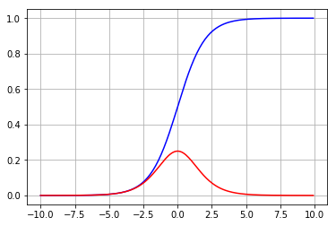
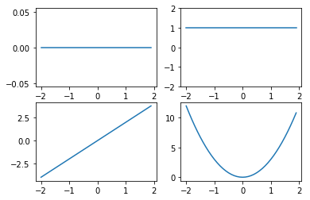
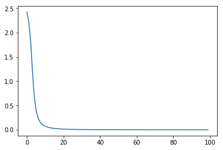

```python
from sklearn.datasets import load_digits
from sklearn.model_selection import train_test_split
import matplotlib.pyplot as plt
import pandas as pd
import numpy as np

digits = load_digits()
print(digits.data.shape)
plt.gray()
plt.matshow(digits.images[0])
plt.show()
```

    (1797, 64)


    <Figure size 640x480 with 0 Axes>


    <Figure size 480x480 with 1 Axes>


```python
print(type(digits['data']))
print(digits['data'].shape)
print(type(digits['target']))
print(digits['target'].shape)
data = digits['data']
target = digits['target'].reshape(1797,1)
df = pd.DataFrame(np.concatenate((data, target), axis = 1))
df.head()
```

    <class 'numpy.ndarray'>
    (1797, 64)
    <class 'numpy.ndarray'>
    (1797,)


<div>
<style scoped>
    .dataframe tbody tr th:only-of-type {
        vertical-align: middle;
    }

    .dataframe tbody tr th {
        vertical-align: top;
    }

    .dataframe thead th {
        text-align: right;
    }
</style>
<table border="1" class="dataframe">
  <thead>
    <tr style="text-align: right;">
      <th></th>
      <th>0</th>
      <th>1</th>
      <th>2</th>
      <th>3</th>
      <th>4</th>
      <th>5</th>
      <th>6</th>
      <th>7</th>
      <th>8</th>
      <th>9</th>
      <th>...</th>
      <th>55</th>
      <th>56</th>
      <th>57</th>
      <th>58</th>
      <th>59</th>
      <th>60</th>
      <th>61</th>
      <th>62</th>
      <th>63</th>
      <th>64</th>
    </tr>
  </thead>
  <tbody>
    <tr>
      <th>0</th>
      <td>0.0</td>
      <td>0.0</td>
      <td>5.0</td>
      <td>13.0</td>
      <td>9.0</td>
      <td>1.0</td>
      <td>0.0</td>
      <td>0.0</td>
      <td>0.0</td>
      <td>0.0</td>
      <td>...</td>
      <td>0.0</td>
      <td>0.0</td>
      <td>0.0</td>
      <td>6.0</td>
      <td>13.0</td>
      <td>10.0</td>
      <td>0.0</td>
      <td>0.0</td>
      <td>0.0</td>
      <td>0.0</td>
    </tr>
    <tr>
      <th>1</th>
      <td>0.0</td>
      <td>0.0</td>
      <td>0.0</td>
      <td>12.0</td>
      <td>13.0</td>
      <td>5.0</td>
      <td>0.0</td>
      <td>0.0</td>
      <td>0.0</td>
      <td>0.0</td>
      <td>...</td>
      <td>0.0</td>
      <td>0.0</td>
      <td>0.0</td>
      <td>0.0</td>
      <td>11.0</td>
      <td>16.0</td>
      <td>10.0</td>
      <td>0.0</td>
      <td>0.0</td>
      <td>1.0</td>
    </tr>
    <tr>
      <th>2</th>
      <td>0.0</td>
      <td>0.0</td>
      <td>0.0</td>
      <td>4.0</td>
      <td>15.0</td>
      <td>12.0</td>
      <td>0.0</td>
      <td>0.0</td>
      <td>0.0</td>
      <td>0.0</td>
      <td>...</td>
      <td>0.0</td>
      <td>0.0</td>
      <td>0.0</td>
      <td>0.0</td>
      <td>3.0</td>
      <td>11.0</td>
      <td>16.0</td>
      <td>9.0</td>
      <td>0.0</td>
      <td>2.0</td>
    </tr>
    <tr>
      <th>3</th>
      <td>0.0</td>
      <td>0.0</td>
      <td>7.0</td>
      <td>15.0</td>
      <td>13.0</td>
      <td>1.0</td>
      <td>0.0</td>
      <td>0.0</td>
      <td>0.0</td>
      <td>8.0</td>
      <td>...</td>
      <td>0.0</td>
      <td>0.0</td>
      <td>0.0</td>
      <td>7.0</td>
      <td>13.0</td>
      <td>13.0</td>
      <td>9.0</td>
      <td>0.0</td>
      <td>0.0</td>
      <td>3.0</td>
    </tr>
    <tr>
      <th>4</th>
      <td>0.0</td>
      <td>0.0</td>
      <td>0.0</td>
      <td>1.0</td>
      <td>11.0</td>
      <td>0.0</td>
      <td>0.0</td>
      <td>0.0</td>
      <td>0.0</td>
      <td>0.0</td>
      <td>...</td>
      <td>0.0</td>
      <td>0.0</td>
      <td>0.0</td>
      <td>0.0</td>
      <td>2.0</td>
      <td>16.0</td>
      <td>4.0</td>
      <td>0.0</td>
      <td>0.0</td>
      <td>4.0</td>
    </tr>
  </tbody>
</table>
<p>5 rows × 65 columns</p>
</div>


```python
data_df = pd.DataFrame(digits['data'])
data_df.head()
```


<div>
<style scoped>
    .dataframe tbody tr th:only-of-type {
        vertical-align: middle;
    }

    .dataframe tbody tr th {
        vertical-align: top;
    }

    .dataframe thead th {
        text-align: right;
    }
</style>
<table border="1" class="dataframe">
  <thead>
    <tr style="text-align: right;">
      <th></th>
      <th>0</th>
      <th>1</th>
      <th>2</th>
      <th>3</th>
      <th>4</th>
      <th>5</th>
      <th>6</th>
      <th>7</th>
      <th>8</th>
      <th>9</th>
      <th>...</th>
      <th>54</th>
      <th>55</th>
      <th>56</th>
      <th>57</th>
      <th>58</th>
      <th>59</th>
      <th>60</th>
      <th>61</th>
      <th>62</th>
      <th>63</th>
    </tr>
  </thead>
  <tbody>
    <tr>
      <th>0</th>
      <td>0.0</td>
      <td>0.0</td>
      <td>5.0</td>
      <td>13.0</td>
      <td>9.0</td>
      <td>1.0</td>
      <td>0.0</td>
      <td>0.0</td>
      <td>0.0</td>
      <td>0.0</td>
      <td>...</td>
      <td>0.0</td>
      <td>0.0</td>
      <td>0.0</td>
      <td>0.0</td>
      <td>6.0</td>
      <td>13.0</td>
      <td>10.0</td>
      <td>0.0</td>
      <td>0.0</td>
      <td>0.0</td>
    </tr>
    <tr>
      <th>1</th>
      <td>0.0</td>
      <td>0.0</td>
      <td>0.0</td>
      <td>12.0</td>
      <td>13.0</td>
      <td>5.0</td>
      <td>0.0</td>
      <td>0.0</td>
      <td>0.0</td>
      <td>0.0</td>
      <td>...</td>
      <td>0.0</td>
      <td>0.0</td>
      <td>0.0</td>
      <td>0.0</td>
      <td>0.0</td>
      <td>11.0</td>
      <td>16.0</td>
      <td>10.0</td>
      <td>0.0</td>
      <td>0.0</td>
    </tr>
    <tr>
      <th>2</th>
      <td>0.0</td>
      <td>0.0</td>
      <td>0.0</td>
      <td>4.0</td>
      <td>15.0</td>
      <td>12.0</td>
      <td>0.0</td>
      <td>0.0</td>
      <td>0.0</td>
      <td>0.0</td>
      <td>...</td>
      <td>5.0</td>
      <td>0.0</td>
      <td>0.0</td>
      <td>0.0</td>
      <td>0.0</td>
      <td>3.0</td>
      <td>11.0</td>
      <td>16.0</td>
      <td>9.0</td>
      <td>0.0</td>
    </tr>
    <tr>
      <th>3</th>
      <td>0.0</td>
      <td>0.0</td>
      <td>7.0</td>
      <td>15.0</td>
      <td>13.0</td>
      <td>1.0</td>
      <td>0.0</td>
      <td>0.0</td>
      <td>0.0</td>
      <td>8.0</td>
      <td>...</td>
      <td>9.0</td>
      <td>0.0</td>
      <td>0.0</td>
      <td>0.0</td>
      <td>7.0</td>
      <td>13.0</td>
      <td>13.0</td>
      <td>9.0</td>
      <td>0.0</td>
      <td>0.0</td>
    </tr>
    <tr>
      <th>4</th>
      <td>0.0</td>
      <td>0.0</td>
      <td>0.0</td>
      <td>1.0</td>
      <td>11.0</td>
      <td>0.0</td>
      <td>0.0</td>
      <td>0.0</td>
      <td>0.0</td>
      <td>0.0</td>
      <td>...</td>
      <td>0.0</td>
      <td>0.0</td>
      <td>0.0</td>
      <td>0.0</td>
      <td>0.0</td>
      <td>2.0</td>
      <td>16.0</td>
      <td>4.0</td>
      <td>0.0</td>
      <td>0.0</td>
    </tr>
  </tbody>
</table>
<p>5 rows × 64 columns</p>
</div>


```python
label_df = pd.DataFrame(digits['target'])
label_df.head()
```


<div>
<style scoped>
    .dataframe tbody tr th:only-of-type {
        vertical-align: middle;
    }

    .dataframe tbody tr th {
        vertical-align: top;
    }

    .dataframe thead th {
        text-align: right;
    }
</style>
<table border="1" class="dataframe">
  <thead>
    <tr style="text-align: right;">
      <th></th>
      <th>0</th>
    </tr>
  </thead>
  <tbody>
    <tr>
      <th>0</th>
      <td>0</td>
    </tr>
    <tr>
      <th>1</th>
      <td>1</td>
    </tr>
    <tr>
      <th>2</th>
      <td>2</td>
    </tr>
    <tr>
      <th>3</th>
      <td>3</td>
    </tr>
    <tr>
      <th>4</th>
      <td>4</td>
    </tr>
  </tbody>
</table>
</div>


# Practice feature normalize


```python
#from scipy.stats import zscore
def normalize(x):
    m = x.max()
    if m != 0:
        return x/m
    else:
        return x
data_df = data_df.apply(normalize, axis=0)
data_df.head()
```


<div>
<style scoped>
    .dataframe tbody tr th:only-of-type {
        vertical-align: middle;
    }

    .dataframe tbody tr th {
        vertical-align: top;
    }

    .dataframe thead th {
        text-align: right;
    }
</style>
<table border="1" class="dataframe">
  <thead>
    <tr style="text-align: right;">
      <th></th>
      <th>0</th>
      <th>1</th>
      <th>2</th>
      <th>3</th>
      <th>4</th>
      <th>5</th>
      <th>6</th>
      <th>7</th>
      <th>8</th>
      <th>9</th>
      <th>...</th>
      <th>54</th>
      <th>55</th>
      <th>56</th>
      <th>57</th>
      <th>58</th>
      <th>59</th>
      <th>60</th>
      <th>61</th>
      <th>62</th>
      <th>63</th>
    </tr>
  </thead>
  <tbody>
    <tr>
      <th>0</th>
      <td>0.0</td>
      <td>0.0</td>
      <td>0.3125</td>
      <td>0.8125</td>
      <td>0.5625</td>
      <td>0.0625</td>
      <td>0.0</td>
      <td>0.0</td>
      <td>0.0</td>
      <td>0.0</td>
      <td>...</td>
      <td>0.0000</td>
      <td>0.0</td>
      <td>0.0</td>
      <td>0.0</td>
      <td>0.3750</td>
      <td>0.8125</td>
      <td>0.6250</td>
      <td>0.0000</td>
      <td>0.0000</td>
      <td>0.0</td>
    </tr>
    <tr>
      <th>1</th>
      <td>0.0</td>
      <td>0.0</td>
      <td>0.0000</td>
      <td>0.7500</td>
      <td>0.8125</td>
      <td>0.3125</td>
      <td>0.0</td>
      <td>0.0</td>
      <td>0.0</td>
      <td>0.0</td>
      <td>...</td>
      <td>0.0000</td>
      <td>0.0</td>
      <td>0.0</td>
      <td>0.0</td>
      <td>0.0000</td>
      <td>0.6875</td>
      <td>1.0000</td>
      <td>0.6250</td>
      <td>0.0000</td>
      <td>0.0</td>
    </tr>
    <tr>
      <th>2</th>
      <td>0.0</td>
      <td>0.0</td>
      <td>0.0000</td>
      <td>0.2500</td>
      <td>0.9375</td>
      <td>0.7500</td>
      <td>0.0</td>
      <td>0.0</td>
      <td>0.0</td>
      <td>0.0</td>
      <td>...</td>
      <td>0.3125</td>
      <td>0.0</td>
      <td>0.0</td>
      <td>0.0</td>
      <td>0.0000</td>
      <td>0.1875</td>
      <td>0.6875</td>
      <td>1.0000</td>
      <td>0.5625</td>
      <td>0.0</td>
    </tr>
    <tr>
      <th>3</th>
      <td>0.0</td>
      <td>0.0</td>
      <td>0.4375</td>
      <td>0.9375</td>
      <td>0.8125</td>
      <td>0.0625</td>
      <td>0.0</td>
      <td>0.0</td>
      <td>0.0</td>
      <td>0.5</td>
      <td>...</td>
      <td>0.5625</td>
      <td>0.0</td>
      <td>0.0</td>
      <td>0.0</td>
      <td>0.4375</td>
      <td>0.8125</td>
      <td>0.8125</td>
      <td>0.5625</td>
      <td>0.0000</td>
      <td>0.0</td>
    </tr>
    <tr>
      <th>4</th>
      <td>0.0</td>
      <td>0.0</td>
      <td>0.0000</td>
      <td>0.0625</td>
      <td>0.6875</td>
      <td>0.0000</td>
      <td>0.0</td>
      <td>0.0</td>
      <td>0.0</td>
      <td>0.0</td>
      <td>...</td>
      <td>0.0000</td>
      <td>0.0</td>
      <td>0.0</td>
      <td>0.0</td>
      <td>0.0000</td>
      <td>0.1250</td>
      <td>1.0000</td>
      <td>0.2500</td>
      <td>0.0000</td>
      <td>0.0</td>
    </tr>
  </tbody>
</table>
<p>5 rows × 64 columns</p>
</div>


# Practice label one-hot encoding


```python
label_df = pd.get_dummies(label_df[0])
label_df.head()
```


<div>
<style scoped>
    .dataframe tbody tr th:only-of-type {
        vertical-align: middle;
    }

    .dataframe tbody tr th {
        vertical-align: top;
    }

    .dataframe thead th {
        text-align: right;
    }
</style>
<table border="1" class="dataframe">
  <thead>
    <tr style="text-align: right;">
      <th></th>
      <th>0</th>
      <th>1</th>
      <th>2</th>
      <th>3</th>
      <th>4</th>
      <th>5</th>
      <th>6</th>
      <th>7</th>
      <th>8</th>
      <th>9</th>
    </tr>
  </thead>
  <tbody>
    <tr>
      <th>0</th>
      <td>1</td>
      <td>0</td>
      <td>0</td>
      <td>0</td>
      <td>0</td>
      <td>0</td>
      <td>0</td>
      <td>0</td>
      <td>0</td>
      <td>0</td>
    </tr>
    <tr>
      <th>1</th>
      <td>0</td>
      <td>1</td>
      <td>0</td>
      <td>0</td>
      <td>0</td>
      <td>0</td>
      <td>0</td>
      <td>0</td>
      <td>0</td>
      <td>0</td>
    </tr>
    <tr>
      <th>2</th>
      <td>0</td>
      <td>0</td>
      <td>1</td>
      <td>0</td>
      <td>0</td>
      <td>0</td>
      <td>0</td>
      <td>0</td>
      <td>0</td>
      <td>0</td>
    </tr>
    <tr>
      <th>3</th>
      <td>0</td>
      <td>0</td>
      <td>0</td>
      <td>1</td>
      <td>0</td>
      <td>0</td>
      <td>0</td>
      <td>0</td>
      <td>0</td>
      <td>0</td>
    </tr>
    <tr>
      <th>4</th>
      <td>0</td>
      <td>0</td>
      <td>0</td>
      <td>0</td>
      <td>1</td>
      <td>0</td>
      <td>0</td>
      <td>0</td>
      <td>0</td>
      <td>0</td>
    </tr>
  </tbody>
</table>
</div>


# Handcraft Nerual Network


```python
def sigmoid(x):
    # using sigmoid
    return 1.0 / (1.0 + np.exp(-x)) 

def derivative_sigmoid(x):
    return sigmoid(x)*(1-sigmoid(x))

x = np.arange(-10, 10, 0.1)
y = [sigmoid(x) for x in x]
y_d = [derivative_sigmoid(x) for x in x]
plt.plot(x, y, 'b', x, y_d, 'r')
plt.grid()

a = np.array([[-1, 1],[-0.5,0.5]])
print(sigmoid(a))
print(sigmoid(a)*(1-sigmoid(a)))


```

    [[0.26894142 0.73105858]
     [0.37754067 0.62245933]]
    [[0.19661193 0.19661193]
     [0.23500371 0.23500371]]





```python
def derivative(f, x):
    h = 1e-4
    return(f(x+h)-f(x-h))/(2*h)

x = np.arange(-10, 10, 0.1)
y = [sigmoid(x) for x in x]
x_de = [derivative(sigmoid, x) for x in x]
plt.plot(x, y, 'b', x, x_de, 'r')
plt.grid()
```


```python
def partial_derivative(f, x):
    h = 1e-4 # 0.0001
    grad = np.zeros_like(x)
    it = np.nditer(x, flags=['multi_index'], op_flags=['readwrite']) # a multi-dimensional iterator (to iterate over an array)
    #print(type(it))
    while not it.finished:
        idx = it.multi_index #多index(多維)
        #print(idx)
        tmp_val = x[idx]
        x[idx] = tmp_val + h
        fxh1 = f(x) # f(x+h)
        x[idx] = tmp_val - h
        fxh2 = f(x) # f(x-h)
        grad[idx] = (fxh1 - fxh2) / (2*h)
        x[idx] = tmp_val
        it.iternext()   
    return grad

l = lambda x: x[0,0]**0+x[0,1]**1+x[1,0]**2+x[1,1]**3
print(partial_derivative(l, np.array([[4.0,3.0],[2.0,1.0]])))

y_arr = []
x_arr = np.arange(-2, 2, 0.1)
for i in x_arr:
    y_arr.append(partial_derivative(l, np.array([[i,i],[i,i]])))

plt.subplot(221)
plt.plot(x_arr,[y_arr[i][0,0] for i in np.arange(len(y_arr))])

plt.subplot(222)
plt.plot(x_arr,[y_arr[i][0,1] for i in np.arange(len(y_arr))])
plt.ylim((-2,2))

plt.subplot(223)
plt.plot(x_arr,[y_arr[i][1,0] for i in np.arange(len(y_arr))])

plt.subplot(224)
plt.plot(x_arr,[y_arr[i][1,1] for i in np.arange(len(y_arr))])

plt.show()
```

    [[0.         1.        ]
     [4.         3.00000001]]





```python
def cross_entropy(vect1, vect2):
    return -np.sum(np.log(np.dot(vect1.T, vect2) + 1e-7))

vect1 = np.array([[0, 1], [1, 0]]).T
vect2 = np.array([[.8, .2],[.2,.8]]).T
cross_entropy(vect1, vect2)
```


    3.6651616774968856


```python
def soft_max(in_vect):
    return np.exp(in_vect) / np.sum(np.exp(in_vect))

a = np.arange(9).reshape(3,-1)
print(a)
print(np.sum(a, axis=1).reshape(-1, 1))
print(a/np.sum(a, axis=1).reshape(-1, 1))
print(soft_max(np.arange(9).reshape(3,-1)))
print(soft_max(np.array([[0, 0, 0]]).T))
```

    [[0 1 2]
     [3 4 5]
     [6 7 8]]
    [[ 3]
     [12]
     [21]]
    [[0.         0.33333333 0.66666667]
     [0.25       0.33333333 0.41666667]
     [0.28571429 0.33333333 0.38095238]]
    [[2.12078996e-04 5.76490482e-04 1.56706360e-03]
     [4.25972051e-03 1.15791209e-02 3.14753138e-02]
     [8.55587737e-02 2.32572860e-01 6.32198578e-01]]
    [[0.33333333]
     [0.33333333]
     [0.33333333]]


# Create Datasets


```python
import itertools
in_perm = []
in_perm.extend(list(itertools.permutations([0.0, 0.0, 0.0])))
in_perm.extend(list(itertools.permutations([1.0, 0.0, 0.0])))
in_perm.extend(list(itertools.permutations([1.0, 1.0, 0.0])))
in_perm.extend(list(itertools.permutations([1.0, 1.0, 1.0])))
in_vect = [np.array([perm]).T for perm in in_perm]
print(len(in_vect))
obj_func = lambda x: np.array([[np.sum(x)%2, (np.sum(x)+1)%2]]).T

obj_vect = [obj_func(vect) for vect in in_vect]
for i in range(24):
    print('input:\n', in_vect[i])
    print('target:\n', obj_vect[i])
```

    24
    input:
     [[0.]
     [0.]
     [0.]]
    target:
     [[0.]
     [1.]]
    input:
     [[0.]
     [0.]
     [0.]]
    target:
     [[0.]
     [1.]]
    input:
     [[0.]
     [0.]
     [0.]]
    target:
     [[0.]
     [1.]]
    input:
     [[0.]
     [0.]
     [0.]]
    target:
     [[0.]
     [1.]]
    input:
     [[0.]
     [0.]
     [0.]]
    target:
     [[0.]
     [1.]]
    input:
     [[0.]
     [0.]
     [0.]]
    target:
     [[0.]
     [1.]]
    input:
     [[1.]
     [0.]
     [0.]]
    target:
     [[1.]
     [0.]]
    input:
     [[1.]
     [0.]
     [0.]]
    target:
     [[1.]
     [0.]]
    input:
     [[0.]
     [1.]
     [0.]]
    target:
     [[1.]
     [0.]]
    input:
     [[0.]
     [0.]
     [1.]]
    target:
     [[1.]
     [0.]]
    input:
     [[0.]
     [1.]
     [0.]]
    target:
     [[1.]
     [0.]]
    input:
     [[0.]
     [0.]
     [1.]]
    target:
     [[1.]
     [0.]]
    input:
     [[1.]
     [1.]
     [0.]]
    target:
     [[0.]
     [1.]]
    input:
     [[1.]
     [0.]
     [1.]]
    target:
     [[0.]
     [1.]]
    input:
     [[1.]
     [1.]
     [0.]]
    target:
     [[0.]
     [1.]]
    input:
     [[1.]
     [0.]
     [1.]]
    target:
     [[0.]
     [1.]]
    input:
     [[0.]
     [1.]
     [1.]]
    target:
     [[0.]
     [1.]]
    input:
     [[0.]
     [1.]
     [1.]]
    target:
     [[0.]
     [1.]]
    input:
     [[1.]
     [1.]
     [1.]]
    target:
     [[1.]
     [0.]]
    input:
     [[1.]
     [1.]
     [1.]]
    target:
     [[1.]
     [0.]]
    input:
     [[1.]
     [1.]
     [1.]]
    target:
     [[1.]
     [0.]]
    input:
     [[1.]
     [1.]
     [1.]]
    target:
     [[1.]
     [0.]]
    input:
     [[1.]
     [1.]
     [1.]]
    target:
     [[1.]
     [0.]]
    input:
     [[1.]
     [1.]
     [1.]]
    target:
     [[1.]
     [0.]]


```python
def acc(in_data, out_data, target_func):
    data_num = len(in_data)
    correct_num = 0
    for i in range(data_num):
        if np.array_equal(target_func(in_data[i]), out_data[i]):
            correct_num += 1
    return correct_num/data_num

print(acc(in_vect, obj_vect, obj_func))

```

    1.0


```python
def predict_encode(x):
    np.argmax(x, axis=0)
    out = np.zeros_like(x)
    out[np.argmax(x, axis=0)] = 1.0
    return out


print(predict_encode(np.array([[0.1, 0.3, 0.5, 0.1]]).T))

```

    [[0.]
     [0.]
     [1.]
     [0.]]


```python
class TwoLayerNet:
    def __init__(self, input_size, hidden_size, output_size):
        self.param = {}
        self.input_size = input_size
        self.hidden_size = hidden_size
        self.output_size = output_size
        
        self.param['w1'] = 0.1*np.random.randn(hidden_size, input_size)
        self.param['b1'] = 0.1*np.random.randn(hidden_size, 1)
        self.param['w2'] = 0.1*np.random.randn(output_size, hidden_size)
        self.param['b2'] = 0.1*np.random.randn(output_size, 1)

    def predict(self, in_vect):
        layer1 = sigmoid(np.dot(self.param['w1'], in_vect) + self.param['b1'])
        layer_out = np.dot(self.param['w2'], layer1) + self.param['b2']
        return soft_max(layer_out)
    
    def show(self):
        print('parameter:')
        print(self.param)
        
    # numerical method
    def update(self, learning_rate, loss_func):
        grad = {}
        for name, matrix in self.param.items():
            grad[name] = partial_derivative(loss_func, self.param[name])
        #print('grad', grad)
        for name, matrix in self.param.items():
            self.param[name] -= learning_rate*grad[name]
    
    # back propagation method
    def update_with_bp(self, in_vect, learning_rate, t_vect):
        hidden_size, input_size = self.param['w1'].shape
        self.forward = {}
        self.backward = {}
        
        # get forward path
        self.forward['w1'] = np.repeat(in_vect.T, hidden_size, axis=0)
        self.forward['b1'] = np.ones((hidden_size, 1))
        self.forward['s1'] = np.dot(self.param['w1'], in_vect)
        self.forward['w2'] = np.repeat(sigmoid(self.forward['s1']).T, self.output_size, axis=0)
        self.forward['b2'] = np.ones((self.output_size, 1))
        
        # get backward path
        p_vect = self.predict(in_vect)
        self.backward['w2'] = np.repeat(p_vect - t_vect, hidden_size, axis=1)
        self.backward['b2'] = p_vect - t_vect
        bp_sum = np.sum(np.multiply(self.backward['w2'], self.param['w2']), axis=0).reshape(hidden_size, 1)
        #print('bp_sum:', bp_sum)
        #print('de s1:', derivative_sigmoid(self.forward['s1']))
        bp_gain = np.multiply(bp_sum, derivative_sigmoid(self.forward['s1']))
        #print('bp_gain:', bp_gain)
        self.backward['w1'] = np.repeat(bp_gain, input_size, axis=1)
        self.backward['b1'] = bp_gain
        
        # calculate gradient and update
        for name, matrix in self.param.items():
            #print('name:', name)
            #print('matrix:', matrix)
            self.param[name] -= learning_rate*np.multiply(self.forward[name], self.backward[name])

```


```python
x_train, x_test, y_train, y_test = train_test_split(data_df, label_df, test_size = 0.2)

layer_net = TwoLayerNet(64, 64, 10)
print(layer_net.predict(np.array(x_train.iloc[0]).reshape(64,1)))
print('x_train len:', len(x_train))
print('=== start training a layer ===')
lost_trace = []
for i in range(100):
    for j in range(len(x_train)):
    #for j in range(10):
        in_vect = np.array(x_train.iloc[j]).reshape(64,1)
        obj_vect = np.array(y_train.iloc[j]).reshape(10,1)
        #print('in_vect:', in_vect)
        #print('obj_vect:', obj_vect)
        layer_net.update_with_bp(in_vect, 0.01, obj_vect)
        if j % 1600 == 0:
            loss = cross_entropy(obj_vect, layer_net.predict(in_vect))
            lost_trace.append(loss)
            print('iteration:{} loss:{}'.format(i, loss))

print('=== after training a layer ===')
print(layer_net.predict(np.array(x_train.iloc[0]).reshape(64,1)))
plt.plot(lost_trace)
plt.show()
    
print('=== acc rate ===')
test_num = len(x_train)
correct_num = 0.0
for i in range(test_num):
    outcome = predict_encode(layer_net.predict(np.array(x_train.iloc[i]).reshape(64,1)))
    if np.array_equal(outcome, np.array(y_train.iloc[i]).reshape(10,1)):
        correct_num += 1.0
print('training acc:', correct_num/test_num)


```

    [[0.10011212]
     [0.13248548]
     [0.06713195]
     [0.12593636]
     [0.1287588 ]
     [0.0750943 ]
     [0.06684926]
     [0.14519498]
     [0.06653868]
     [0.09189805]]
    x_train len: 1437
    === start training a layer ===
    iteration:0 loss:2.4256046529402178
    iteration:1 loss:2.2137438825700215
    iteration:2 loss:1.8241989394664504
    iteration:3 loss:1.1922368138250075
    iteration:4 loss:0.6721837011177472
    iteration:5 loss:0.3909770760580921
    iteration:6 loss:0.24719447630829453
    iteration:7 loss:0.16854953785722074
    iteration:8 loss:0.12180647563893636
    iteration:9 loss:0.0918826142168096
    iteration:10 loss:0.07153362352266425
    iteration:11 loss:0.057026405053462605
    iteration:12 loss:0.046299362849959204
    iteration:13 loss:0.03813989298738494
    iteration:14 loss:0.031794197337723075
    iteration:15 loss:0.026770927601015394
    iteration:16 loss:0.022736706069128625
    iteration:17 loss:0.019457609025484338
    iteration:18 loss:0.016764839083878894
    iteration:19 loss:0.014533732654773942
    iteration:20 loss:0.012670433294963044
    iteration:21 loss:0.011103141594838052
    iteration:22 loss:0.009776193366525144
    iteration:23 loss:0.00864594273272311
    iteration:24 loss:0.007677832015809271
    iteration:25 loss:0.00684426386143721
    iteration:26 loss:0.006123029369138102
    iteration:27 loss:0.005496130174070318
    iteration:28 loss:0.004948885025169789
    iteration:29 loss:0.0044692451659380196
    iteration:30 loss:0.004047265065460272
    iteration:31 loss:0.0036746900651063313
    iteration:32 loss:0.0033446328771281255
    iteration:33 loss:0.0030513181765888103
    iteration:34 loss:0.0027898797628326
    iteration:35 loss:0.0025561985729177406
    iteration:36 loss:0.002346772631287256
    iteration:37 loss:0.002158612104167228
    iteration:38 loss:0.001989154191465971
    iteration:39 loss:0.0018361937720518429
    iteration:40 loss:0.0016978266192058586
    iteration:41 loss:0.0015724026931164378
    iteration:42 loss:0.0014584875487489858
    iteration:43 loss:0.0013548303087238872
    iteration:44 loss:0.0012603369705957523
    iteration:45 loss:0.001174048067589005
    iteration:46 loss:0.0010951198975688201
    iteration:47 loss:0.0010228086890873883
    iteration:48 loss:0.000956457195067888
    iteration:49 loss:0.0008954833012460734
    iteration:50 loss:0.000839370313370277
    iteration:51 loss:0.0007876586486109592
    iteration:52 loss:0.0007399387059403913
    iteration:53 loss:0.0006958447299663065
    iteration:54 loss:0.0006550495148063959
    iteration:55 loss:0.0006172598206803096
    iteration:56 loss:0.0005822123971240626
    iteration:57 loss:0.000549670524126213
    iteration:58 loss:0.0005194209967467527
    iteration:59 loss:0.0004912714905506014
    iteration:60 loss:0.00046504825491269704
    iteration:61 loss:0.0004405940893376396
    iteration:62 loss:0.00041776656466029527
    iteration:63 loss:0.0003964364566229338
    iteration:64 loss:0.00037648636404578596
    iteration:65 loss:0.00035780948776527056
    iteration:66 loss:0.00034030854987017483
    iteration:67 loss:0.00032389483559872376
    iteration:68 loss:0.0003084873426521812
    iteration:69 loss:0.00029401202473825573
    iteration:70 loss:0.00028040111789775693
    iteration:71 loss:0.0002675925396596919
    iteration:72 loss:0.00025552935235889597
    iteration:73 loss:0.00024415928305910494
    iteration:74 loss:0.00023343429346800958
    iteration:75 loss:0.00022331019407733363
    iteration:76 loss:0.0002137462974708676
    iteration:77 loss:0.00020470510636953865
    iteration:78 loss:0.00019615203254077533
    iteration:79 loss:0.00018805514316361235
    iteration:80 loss:0.00018038493166466375
    iteration:81 loss:0.00017311411040688812
    iteration:82 loss:0.00016621742291236623
    iteration:83 loss:0.00015967147359887906
    iteration:84 loss:0.0001534545732241101
    iteration:85 loss:0.00014754659845620468
    iteration:86 loss:0.00014192886416137737
    iteration:87 loss:0.0001365840071542562
    iteration:88 loss:0.00013149588029859042
    iteration:89 loss:0.00012664945595918369
    iteration:90 loss:0.00012203073791532502
    iteration:91 loss:0.00011762668093171106
    iteration:92 loss:0.00011342511727242604
    iteration:93 loss:0.00010941468950566554
    iteration:94 loss:0.00010558478901975533
    iteration:95 loss:0.0001019254997237653
    iteration:96 loss:9.842754645885999e-05
    iteration:97 loss:9.508224768947328e-05
    iteration:98 loss:9.188147209154577e-05
    iteration:99 loss:8.881759868099853e-05
    === after training a layer ===
    [[1.83606262e-06]
     [6.42038380e-09]
     [3.12701599e-09]
     [4.06365006e-05]
     [1.50560984e-07]
     [9.99914016e-01]
     [1.78530239e-06]
     [1.57171192e-05]
     [1.26473936e-07]
     [2.57224677e-05]]





    === acc rate ===
    training acc: 0.9958246346555324

